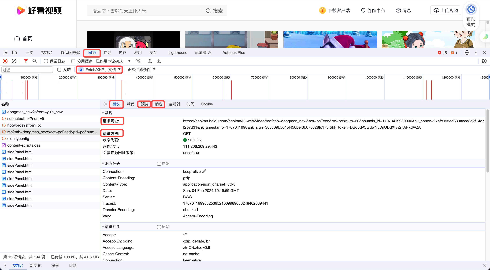

# Python采集某小视频网站数据
［课程内容］：Python采集某小视频网站数据

［授课老师］：青灯教育-自游［上课时间］：14：35

［环境使用］：<br>
- Python 3.8 <br>
- Pycharm

［模块使用］:<br>
- requests >>> pip install requests

[本节内容]
1. 采集视频内容
2. 采集视频信息相关数据保存表格 csv/Excel


爬虫实现步骤：
1. 发送请求，对于刚刚分析得到的url地址发送请求
2. 获取数据，获取服务器返回的响应数据
3. 解析数据，提取想要的数据内容
4. 保存数据，把相应的数据保存到本地文件中

# 导入数据请求模块
```python
import requests # pip install requests 模块导入未使用灰色待机状态
import pandas as pd # pip install pandas
# 发送请求的网址
url = 'https://haokan.baidu.com/haokan/ui-web/video/rec?tab=dongman_new&act=pcFeed&pd=pc&num=20&shuaxin_id=17070419980000&hk_nonce=27efc995ed339aeea3d2f14c7f2b7d31&hk_timestamp=1707041998&hk_sign=303c09b5c4bf456bef0b076328fc173f&hk_token=DBd8dAVwdwNyDnUDdXt%2FARkdAQA'
# headers 请求头 伪装python代码 模拟成浏览器去发送请求，为了防止被反爬
# User-Agent 用户代理 表示浏览器基本身份标识
headers = {'User-Agent':'Mozilla/5.0 (Macintosh; Intel Mac OS X 10_15_7) AppleWebKit/537.36 (KHTML, like Gecko) Chrome/121.0.0.0 Safari/537.36'}
# 通过requests模块里面get请求方法对于url地址发送请求，并且携带上headers请求头伪装，最后用自定义变量response接收返回数据
response = requests.get(url,headers=headers)
# <Response [200]> response返回对象 200 状态码表示请求成功
# response.json() 获取响应对象json字典数据 提取字典数据里面的内容 就可以键值对取值 根据冒号左边的内容 提取冒号右边的内容
# python里面 []列表数据 {}字典数据类型或者集合 type()查看数据类型
videos = response.json()['data']['response']['videos']
lis = []
# print(response.json())
# print(videos)
# print(type(videos))
for video in videos: # for循环遍历，可以对于一个列表里面元素进行一个一个提取
    play_url = video['play_url'] # 视频播放地址
    title = video['title'] # 视频标题
    comment = video['comment'] # 视频评论数
    duration = video['duration'] # 视频时长
    fmplaycnt = video['fmplaycnt_2'] # 视频播放数
    like = video['like'] # 视频点赞数
    publish_time = video['publish_time'] # 视频发布时间
    source_name = video['source_name'] # 视频博主
    dit = {
        '视频标题':title,
        '视频博主':source_name
        '视频发布时间':publish_time,
        '视频点赞数':like,
        '视频播放数':fmplaycnt,
        '视频评论数':comment,
        '视频时长':duration,
        '视频播放地址':play_url,
    }
    lis.append(dit)

pd.DataFrame(lis).to_excel('data.xlsx',index=False)
```