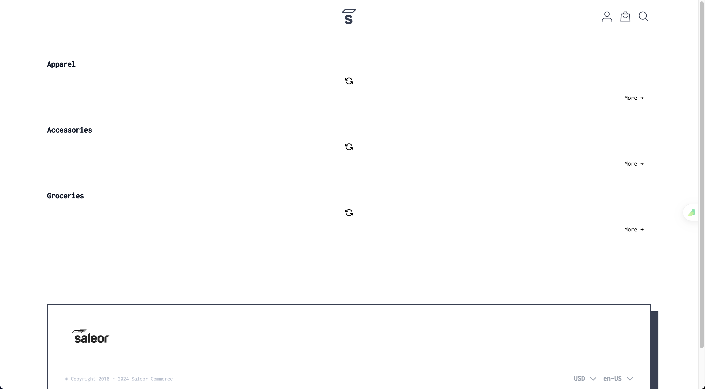

# 【动态网页抓取】 ：用Python抓取所有内容的指南
## 一、说明
您在抓取动态网页内容时是否得到了糟糕的结果？不仅仅是你。对于标准抓取工具来说，爬网动态数据是一项具有挑战性的任务（至少可以说）。这是因为当发出HTTP请求时，响应程序的某些部分JavaScript在后台运行，而 抓取动态网站需要在浏览器中呈现整个页面并提取目标信息。

加入我们的分步教程，了解有关使用 Python 进行动态网页抓取的所有信息——该做什么和不该做什么、挑战和解决方案，以及介于两者之间的一切。
## 二、什么是动态网站？
动态网站是指没有直接在其静态HTML中包含所有内容的网站。它使用服务器端或客户端来显示数据，有时基于用户的操作（例如，单击、滚动等）。

简而言之，这些网站在每个服务器请求中显示不同的内容或布局。这有助于缩短加载时间，因为用户每次想要查看“新”内容时都无需重新加载相同的信息。

如何识别它们？一种方法是在浏览器的命令面板中禁用 JavaScript。如果网站是动态的，内容将消失。

让我们以 [Saleor React Storefront](https://www.jackchim.com/default-channel/en-US/) 为例。这是它的首页的样子：


注意标题、图像和艺术家姓名。

现在，让我们使用以下步骤禁用 JavaScript：

1. 检查页面：右键单击并选择“检查”以打开“DevTools 窗口”。
2. 导航到命令面板：CTRL/CMD + SHIFT + P。
3. 搜索“JavaScript”。
4. 单击禁用 JavaScript。
5. 点击刷新。

结果如何？见下文：



你自己看！禁用 JavaScript 会删除所有动态 Web 内容。

## 三、使用 Python 进行动态网页抓取的替代方案
所以，你想用Python抓取动态网站......

由于 Beautiful Soup 或 Requests 等库不会自动获取动态内容，因此您有两个选项来完成任务：

- 将内容馈送到标准库。
- 在抓取时执行页面的内部 JavaScript。

但是，并非所有动态页面都相同。有些通过 JS API 呈现内容，可以通过检查“网络”选项卡来访问这些内容。其他人将JS渲染的内容作为JSON存储在DOM（文档对象模型）中的某个位置。

好消息是，我们可以解析 JSON 字符串以在这两种情况下提取必要的数据。

请记住，在某些情况下，这些解决方案不适用。对于此类网站，您可以使用无头浏览器来呈现页面并提取所需的数据。

使用 Python 抓取动态网页的替代方法是：

- **手动查找数据并解析 JSON 字符串。**
- **使用无头浏览器执行页面的内部JavaScript**（例如，Selenium或Pyppeteer，Puppeteer的非官方Python端口）。
## 四、在 Python 中抓取动态网站的最简单方法是什么？
的确，无头浏览器可能很慢且性能密集。但是，他们取消了对网络抓取的所有限制。也就是说，如果您不计算反机器人检测。而且您不应该这样做，因为我们已经告诉您如何绕过此类保护。

手动查找数据并解析 JSON 字符串假定可以访问动态数据的 JSON 版本。不幸的是，情况并非总是如此，尤其是在涉及高级单页应用程序 （SPA） 时。

更不用说模仿 API 请求是不可扩展的。他们通常需要 cookie 和身份验证以及其他可以轻松阻止您的限制。

在 Python 中抓取动态网页的最佳方法取决于您的目标和资源。如果您可以访问网站的 JSON 并希望提取单个页面的数据，则可能不需要无头浏览器。

然而，除了这一小部分情况，大多数时候使用美丽的汤和硒是你最好和最简单的选择。

是时候弄脏我们的手了！准备好编写一些代码，并准确地了解如何在 Python 中抓取动态网站！

## 五、先决条件
若要遵循本教程，需要满足一些要求。我们将使用以下工具：

- Python 3：最新版本的 Python 将运行得最好。在撰写本文时，这是 3.11.2。
- 硒
- Web驱动程序管理器：这将确保浏览器和驱动程序的版本匹配。您不必为此目的手动下载 Web 驱动程序。

```python
pip install selenium webdriver-manager 
```
您现在拥有所需的一切。我们走吧！

## 六、方法1：使用Beautiful Soup使用Python进行动态网页抓取
Beautiful Soup可以说是用于抓取HTML数据的最流行的Python库。

要使用它提取信息，我们需要目标页面的 HTML 字符串。但是，动态内容并不直接存在于网站的静态 HTML 中。这意味着 Beautiful Soup 无法访问 JavaScript 生成的数据。

这是一个解决方案：如果网站使用 AJAX 请求加载内容，则可以从 XHR 请求中提取数据。

## 七、方法2：使用Selenium在Python中抓取动态网页
要了解Selenium如何帮助您抓取动态网站，首先，我们需要检查常规库（例如）如何与它们交互。Requests

我们将使用 [Angular](https://angular.io/) 作为我们的目标网站：


让我们尝试刮擦它，看看结果。在此之前，我们必须安装可以使用该命令执行的库。RequestsRequestspip
```python
pip install requests 
```
我们的代码如下所示：
```python
import requests  
url = 'https://angular.io/'  
response = requests.get(url)  
html = response.text  
print(html)
```
如您所见，仅提取了以下 HTML：

```python
<noscript> 
	<div class="background-sky hero"></div> 
	<section id="intro" style="text-shadow: 1px 1px #1976d2;"> 
		<div class="hero-logo"></div> 
		<div class="homepage-container"> 
			<div class="hero-headline">The modern web<br>developer's platform</div> 
		</div> 
	</section> 
	<h2 style="color: red; margin-top: 40px; position: relative; text-align: center; text-shadow: 1px 1px #fafafa; border-top: none;"> 
		<b><i>This website requires JavaScript.</i></b> 
	</h2> 
</noscript>
```
但是，检查网站显示的内容比检索的内容多。

当我们在页面上禁用JavaScript时，就会发生这种情况：


这正是能够返回的原因。该库在解析来自网站静态 HTML 的数据时不会察觉到任何错误，这正是它创建时要做的事情。Requests

在这种情况下，不可能获得与网站上显示的结果相同的结果。你能猜出为什么吗？没错，这是因为这是一个动态网页。

要访问整个内容并提取我们的目标数据，我们必须渲染 JavaScript。

是时候用硒动态网页抓取来纠正它了。

我们将使用以下脚本快速抓取目标网站：
```python
from selenium import webdriver 
from selenium.webdriver.chrome.service import Service as ChromeService 
from webdriver_manager.chrome import ChromeDriverManager 
 
url = 'https://angular.io/' 
 
driver = webdriver.Chrome(service=ChromeService( 
	ChromeDriverManager().install())) 
 
driver.get(url) 
 
print(driver.page_source)
```

你有它！页面的完整 HTML，包括动态 Web 内容。

祝贺！您刚刚抓取了您的第一个动态网站。
## 八、选择硒（Selenium）中的元素
有不同的方法可以访问硒中的元素。我们在 Python 中的硒网络抓取指南中深入讨论了这个问题。

不过，我们将通过一个例子来解释这一点。让我们只选择目标网站上的 H2：


在开始之前，我们需要检查网站并确定要提取的元素的位置。

我们可以看到，这些头条新闻很常见。我们复制它并映射 H2s 以使用 Chrome 驱动程序获取元素。class="text-container"


粘贴此代码：

```python
from selenium import webdriver 
from selenium.webdriver.common.by import By 
from selenium.webdriver.chrome.service import Service as ChromeService 
from webdriver_manager.chrome import ChromeDriverManager 
 
# instantiate options 
options = webdriver.ChromeOptions() 
 
# run browser in headless mode 
options.headless = True 
 
# instantiate driver 
driver = webdriver.Chrome(service=ChromeService( 
	ChromeDriverManager().install()), options=options) 
 
# load website 
url = 'https://angular.io/' 
 
# get the entire website content 
driver.get(url) 
 
# select elements by class name 
elements = driver.find_elements(By.CLASS_NAME, 'text-container') 
for title in elements: 
	# select H2s, within element, by tag name 
	heading = title.find_element(By.TAG_NAME, 'h2').text 
	# print H2s 
	print(heading)
```
您将获得以下内容：
```python
"DEVELOP ACROSS ALL PLATFORMS" 
"SPEED & PERFORMANCE" 
"INCREDIBLE TOOLING" 
"LOVED BY MILLIONS"
```
很好，很容易！您现在可以毫不费力地用硒抓取动态网站。
## 九、如何用硒抓取无限滚动网页
当用户向下滚动到页面底部时，某些动态页面会加载更多内容。这些被称为“精细滚动网站”。爬行它们更具挑战性。为此，我们需要指示我们的蜘蛛滚动到底部，等待所有新内容加载，然后才开始抓取。

通过一个例子来理解这一点。让我们使用刮擦俱乐部的示例页面。


此脚本将滚动浏览前 20 个结果并提取其标题：
```python
from selenium import webdriver 
from selenium.webdriver.common.by import By 
from selenium.webdriver.chrome.service import Service as ChromeService 
from webdriver_manager.chrome import ChromeDriverManager 
import time 
 
options = webdriver.ChromeOptions() 
options.headless = True 
driver = webdriver.Chrome(service=ChromeService( 
	ChromeDriverManager().install()), options=options) 
 
# load target website 
url = 'https://scrapingclub.com/exercise/list_infinite_scroll/' 
 
# get website content 
driver.get(url) 
 
# instantiate items 
items = [] 
 
# instantiate height of webpage 
last_height = driver.execute_script('return document.body.scrollHeight') 
 
# set target count 
itemTargetCount = 20 
 
# scroll to bottom of webpage 
while itemTargetCount > len(items): 
	driver.execute_script('window.scrollTo(0, document.body.scrollHeight);') 
 
	# wait for content to load 
	time.sleep(1) 
 
	new_height = driver.execute_script('return document.body.scrollHeight') 
 
	if new_height == last_height: 
		break 
 
	last_height == new_height 
 
	# select elements by XPath 
	elements = driver.find_elements(By.XPATH, "//div[@class='card-body']/h4/a") 
	h4_texts = [element.text for element in elements] 
 
	items.extend(h4_texts) 
 
	# print title 
	print(h4_texts)
```
备注：为无限滚动页面设置目标计数非常重要，这样您就可以在某个时候结束脚本。

在前面的示例中，我们使用了另一个选择器：。它将基于 XPath 而不是类和 ID 来定位元素，如前所述。检查页面，右键单击包含要抓取的元素的 ，然后选择复制路径。By.XPath<div>

您的结果应如下所示：

```python
['Short Dress', 'Patterned Slacks', 'Short Chiffon Dress', 'Off-the-shoulder Dress', ...]
```
你有它，前 4 种产品的 H20！

备注：使用硒进行动态网页抓取可能会因硒的持续更新而变得棘手。最好通过最新的变化。

十、结论
动态网页无处不在。因此，您在数据提取工作中遇到它们的可能性足够高。请记住，熟悉其结构将帮助您确定检索目标信息的最佳方法。

我们在本文中探讨的所有方法都有其自身的缺点和缺点。所以，看看ZenRows必须提供什么。该解决方案允许您使用简单的 API 调用抓取动态网站。立即免费试用，节省自己的时间和资源。

本文最初发表于 [ZenRows： Dynamic Web Pages Scraping with Python： Guide to Scrape All Content](https://www.zenrows.com/blog/dynamic-web-pages-scraping-python?utm_source=dev.to&utm_medium=social&utm_campaign=republishing)