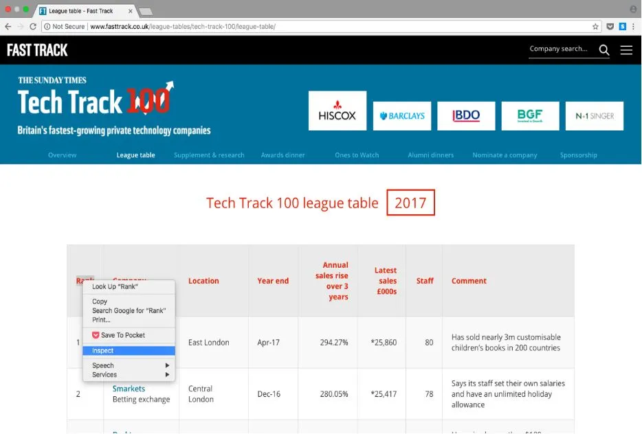
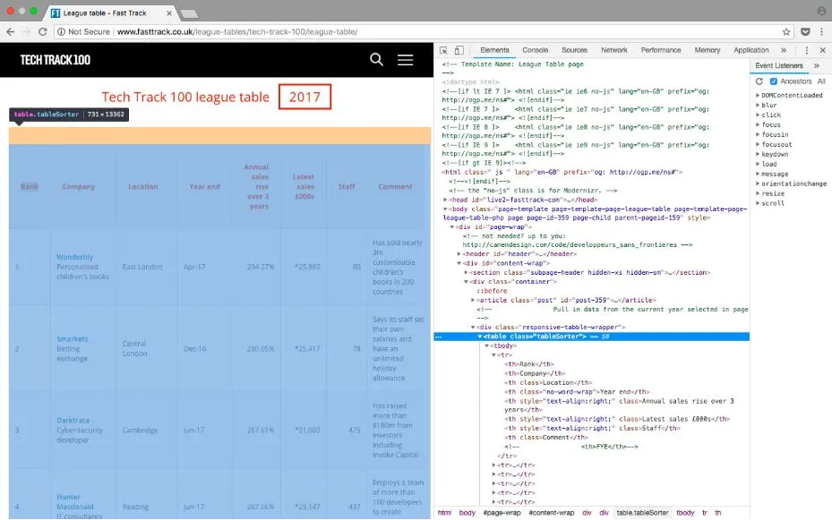
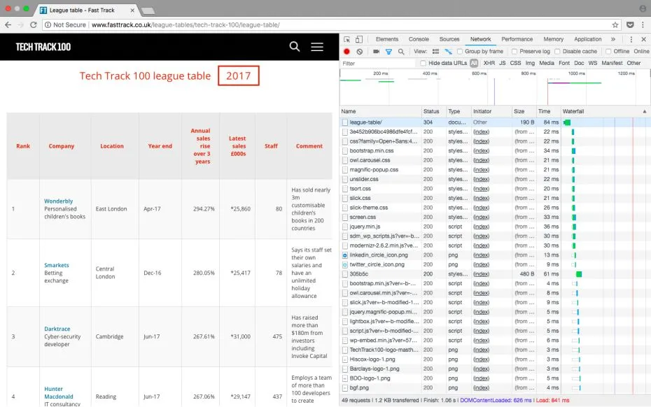
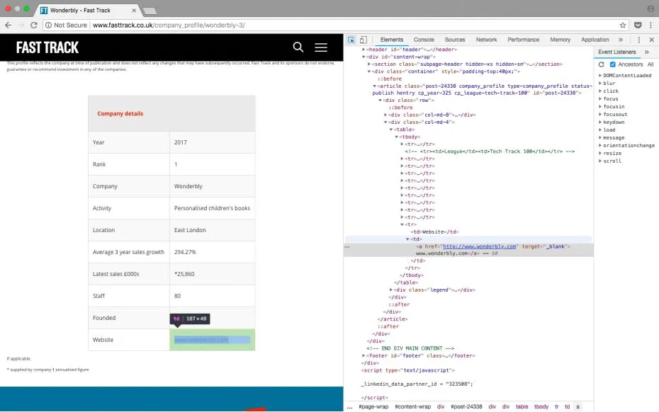

独家 | 手把手教你用Python进行Web抓取（附代码）
===

> 本文用于自学python，原文地址 [独家 | 手把手教你用Python进行Web抓取（附代码）](https://zhuanlan.zhihu.com/p/50600546?utm_id=0&wd=&eqid=f4dae3580000b9880000000464fd22c8)

- [独家 | 手把手教你用Python进行Web抓取（附代码）](#独家--手把手教你用python进行web抓取附代码)
- [准备开始](#准备开始)
- [检查网页](#检查网页)
  - [使用Beautiful Soup解析网页html](#使用beautiful-soup解析网页html)
  - [搜索html元素](#搜索html元素)
  - [循环遍历元素并保存变量](#循环遍历元素并保存变量)
  - [数据清理](#数据清理)
  - [写入输出文件](#写入输出文件)

> 本教程以在Fast Track上收集百强公司的数据为例，教你抓取网页信息。

在本教程中，我将介绍一个简单的例子，说明如何抓取一个网站，我将从Fast Track上收集2018年百强公司的数据：
> Fast Track：http://www.fasttrack.co.uk/

使用网络爬虫将此过程自动化，避免了手工收集数据，节省了时间，还可以让所有数据都放在一个结构化文件中。

用Python实现一个简单的网络爬虫的快速示例，您可以在GitHub上找到本教程中所介绍的完整代码。

> Github: [https://github.com/kaparker/tut...](https://github.com/kaparker/tutorials/blob/master/pythonscraper/websitescrapefasttrack.py)

以下是本文使用Python进行网页抓取的简短教程概述：
* 连接到网页
* 使用BeautifulSoup解析html
* 循环通过soup对象找到元素
* 执行一些简单的数据清理
* 将数据写入csv

# 准备开始
在开始使用任何Python应用程序之前，要问的第一个问题是：我需要哪些库？

对于web抓取，有一些不同的库需要考虑，包括：
* Beautiful Soup
* Requests
* Scrapy
* Selenium

在本例中我们使用Beautiful Soup。你可以使用Python包管理器 pip 安装Beautiful Soup：
```python
pip install BeautifulSoup4
```
安装好这些库之后，让我们开始吧！
# 检查网页
要知道在Python代码中需要定位哪些元素，首先需要检查网页。

要从Tech Track Top 100 companies收集数据，可以通过右键单击感兴趣的元素来检查页面，然后选择检查。这将打开HTML代码，我们可以在其中看到每个字段包含在其中的元素。

>Tech Track Top 100 companies链接：[fasttrack.co.uk/league...](http://www.fasttrack.co.uk/league-tables/tech-track-100/league-table/)




右键单击感兴趣的元素并选择“Inspect”，显示html元素。

由于数据存储在一个表中，因此只需几行代码就可以直接获取数据。如果您想练习抓取网站，这是一个很好的例子，也是一个好的开始，但请记住，它并不总是那么简单！

所有100个结果都包含在<tr> 元素的行中，并且这些在一页上都可见。情况并非总是如此，当结果跨越多个页面时，您可能需要更改网页上显示的结果数量，或者遍历所有页面以收集所有信息。

League Table网页上显示了包含100个结果的表。检查页面时，很容易在html中看到一个模式。结果包含在表格中的行中：
```python
<table class="tableSorter">
```
重复的行`<tr>`将通过在Python中使用循环来查找数据并写入文件来保持我们的代码最小化！

附注：可以做的另一项检查是网站上是否发出了HTTP GET请求，该请求可能已经将结果作为结构化响应（如JSON或XML格式）返回。您可以在检查工具的网络选项卡中进行检查，通常在XHR选项卡中进行检查。刷新页面后，它将在加载时显示请求，如果响应包含格式化结构，则使用REST客户端（如Insomnia）返回输出通常更容易。

刷新网页后，页面检查工具的网络选项卡

## 使用Beautiful Soup解析网页html

现在您已经查看了html的结构并熟悉了将要抓取的内容，是时候开始使用Python了！

第一步是导入将用于网络爬虫的库。我们已经讨论过上面的BeautifulSoup，它有助于我们处理html。我们导入的下一个库是urllib，它连接到网页。最后，我们将输出写入csv，因此我们还需要导入csv 库。作为替代方案，可以在此处使用json库。
```python
# import libraries
from bs4 import BeautifulSoup
import urllib.request
import csv
```
下一步是定义您正在抓取的网址。如上一节所述，此网页在一个页面上显示所有结果，因此此处给出了地址栏中的完整url：
```python
# specify the url
urlpage = 'http://www.fasttrack.co.uk/league-tables/tech-track-100/league-table/'
```
然后我们建立与网页的连接，我们可以使用BeautifulSoup解析html，将对象存储在变量'soup'中：
```python
# query the website and return the html to the variable 'page'
page = urllib.request.urlopen(urlpage)
# parse the html using beautiful soup and store in variable 'soup'
soup = BeautifulSoup(page, 'html.parser')
```
我们可以在这个阶段打印soup变量，它应该返回我们请求网页的完整解析的html。
```python
print(soup)
```
如果存在错误或变量为空，则请求可能不成功。可以使用urllib.error模块在此时实现错误处理。

## 搜索html元素
由于所有结果都包含在表中，我们可以使用find 方法搜索表的soup对象。然后我们可以使用find_all 方法查找表中的每一行。

如果我们打印行数，我们应该得到101的结果，100行加上标题。

```python
# find results within table
table = soup.find('table', attrs={'class': 'tableSorter'})
results = table.find_all('tr')
print('Number of results', len(results))
```
因此，我们可以对结果进行循环以收集数据。

打印soup对象的前两行，我们可以看到每行的结构是：
```html
<tr>
<th>Rank</th>
<th>Company</th>
<th class="">Location</th>
<th>Year end</th>
<th class="" style="text-align:right;">Annual sales rise over 3 years</th>
<th class="" style="text-align:right;">Latest sales £000s</th>
<th class="" style="text-align:right;">Staff</th>
<th class="">Comment</th>
<!-- <th>FYE</th>-->
</tr>
<tr>
<td>1</td>
<td><a href="http://www.fasttrack.co.uk/company_profile/wonderbly-3/"><span>Wonderbly</span></a>Personalised children's books</td>
<td>East London</td>
<td>Apr-17</td>
<td style="text-align:right;">294.27%</td>
<td style="text-align:right;">*25,860</td>
<td style="text-align:right;">80</td>
<td>Has sold nearly 3m customisable children’s books in 200 countries</td>
<!-- <td>Apr-17</td>-->
</tr>
```
表格中有8栏：Rank，Company，Location，Year End，Annual Sales Rise，Latest Sales, Staff and Comments，所有这些都是我们可以保存的感兴趣的数据。

网页的所有行的结构都是一致的（对于所有网站来说可能并非总是如此！）。因此，我们可以再次使用find_all 方法将每一列分配给一个变量，那么我们可以通过搜索<td> 元素来写入csv或JSON。

## 循环遍历元素并保存变量

在Python中，将结果附加到一个列表中是很有用的，然后将数据写到一个文件中。我们应该在循环之前声明列表并设置csv的头文件，如下所示：

```python
# create and write headers to a list
rows = []
rows.append(['Rank', 'Company Name', 'Webpage', 'Description', 'Location', 'Year end', 'Annual sales rise over 3 years', 'Sales £000s', 'Staff', 'Comments'])
print(rows)
```
这将打印出我们添加到包含标题的列表的第一行。

你可能会注意到表格中有一些额外的字段Webpage和Description不是列名，但是如果你仔细看看我们打印上面的soup变量时的html，那么第二行不仅仅包含公司名称。我们可以使用一些进一步的提取来获取这些额外信息。

下一步是循环结果，处理数据并附加到可以写入csv的rows。

在循环中查找结果：
```python
# loop over results
for result in results:
# find all columns per result
data = result.find_all('td')
# check that columns have data
if len(data) == 0:
continue
```
由于表中的第一行仅包含标题，因此我们可以跳过此结果，如上所示。它也不包含任何`<td>`元素，因此在搜索元素时，不会返回任何内容。然后，我们可以通过要求数据的长度为非零来检查是否只处理包含数据的结果。

然后我们可以开始处理数据并保存到变量中。

```python
# write columns to variables
rank = data[0].getText()
company = data[1].getText()
location = data[2].getText()
yearend = data[3].getText()
salesrise = data[4].getText()
sales = data[5].getText()
staff = data[6].getText()
comments = data[7].getText()
```
以上只是从每个列获取文本并保存到变量。但是，其中一些数据需要进一步清理以删除不需要的字符或提取更多信息。

## 数据清理

如果我们打印出变量company，该文本不仅包含公司名称，还包含描述。我们然后打印sales，它包含不需要的字符，如脚注符号，最好删除。

```python
print('Company is', company)
# Company is WonderblyPersonalised children's books
print('Sales', sales)
# Sales *25,860
```
我们希望将company 分为公司名称和描述，我们可以用几行代码实现。再看一下html，对于这个列，有一个 <span> 元素只包含公司名称。此列中还有一个链接指向网站上的另一个页面，其中包含有关该公司的更多详细信息。我们将在稍后使用它！

```html
<td><a href="http://www.fasttrack.co.uk/company_profile/wonderbly-3/"><span>Wonderbly</span></a>Personalised children's books</td>
```
要将company 分成两个字段，我们可以使用find方法保存<span>元素，然后使用strip 或replace 从company 变量中删除公司名称，这样它只留下描述。

要从sales中删除不需要的字符，我们可以再次使用strip和replace 方法！

```python
# extract description from the name
companyname = data[1].find('span', attrs={'class':'company-name'}).getText()
description = company.replace(companyname, '')

# remove unwanted characters
sales = sales.strip('*').strip('†').replace(',','')
```
我们要保存的最后一个变量是公司网站。如上所述，第二列包含指向另一个页面的链接，该页面具有每个公司的概述。 每个公司页面都有自己的表格，大部分时间都包含公司网站。


检查公司页面上的url元素

要从每个表中抓取url并将其保存为变量，我们需要使用与上面相同的步骤：

* 在fast track网站上找到具有公司页面网址的元素
* 向每个公司页面网址发出请求
* 使用Beautifulsoup解析html
* 找到感兴趣的元素
查看一些公司页面，如上面的屏幕截图所示，网址位于表格的最后一行，因此我们可以在最后一行内搜索`<a>`元素。

```python
# go to link and extract company website
url = data[1].find('a').get('href')
page = urllib.request.urlopen(url)
# parse the html
soup = BeautifulSoup(page, 'html.parser')
# find the last result in the table and get the link
try:
tableRow = soup.find('table').find_all('tr')[-1]
webpage = tableRow.find('a').get('href')
except:
webpage = None
```
也有可能出现公司网站未显示的情况，因此我们可以使用try except条件，以防万一找不到网址。

一旦我们将所有数据保存到变量中，我们可以在循环中将每个结果添加到列表rows。
```python
# write each result to rows
rows.append([rank, company, webpage, description, location, yearend, salesrise, sales, staff, comments])
print(rows)
```
然后可以试着在循环外打印变量，在将其写入文件之前检查它是否符合您的预期！

## 写入输出文件

如果想保存此数据以进行分析，可以用Python从我们列表中非常简单地实现。

```python
# Create csv and write rows to output file
with open('techtrack100.csv','w', newline='') as f_output:
csv_output = csv.writer(f_output)
csv_output.writerows(rows)
```
运行Python脚本时，将生成包含100行结果的输出文件，您可以更详细地查看这些结果！

尾语

这是我的第一个教程，如果您有任何问题或意见或者不清楚的地方，请告诉我！

* Web Development[https://towardsdatascience.com...](https://towardsdatascience.com/tagged/web-development?source=post)
* Python[https://towardsdatascience.com...](https://towardsdatascience.com/tagged/python?source=post)
* Web Scraping[https://towardsdatascience.com...](https://towardsdatascience.com/tagged/web-scraping?source=post)
* Data Science[https://towardsdatascience.com...](https://towardsdatascience.com/tagged/data-science?source=post)
* Programming[https://towardsdatascience.com...](https://towardsdatascience.com/tagged/programming?source=post)

---

原文标题：
Data Science Skills: Web scraping using python

原文链接:
https://towardsdatascience.com/data-science-skills-web-scraping-using-python-d1a85ef607ed

